# Guide d'utilisation H'DECOR

Pour Yorick, sur le téléphone. Une tâche par partie, des phrases courtes. Les captures viennent de la **démonstration** : entreprise, clients et montants y sont **fictifs**.

> **À retenir**
> - Tout ce qui est marqué **À VÉRIFIER** attend la confirmation de votre comptable. **À COMPLÉTER** : une information manque.
> - Un devis ou une facture **émis** ne se modifie plus. On fait une nouvelle version (devis) ou un avoir (facture).
> - Les rendements de peinture sont **indicatifs** : la fiche technique du fabricant et le support réel font foi.

## Sommaire

1. [Première configuration](#1-première-configuration)
2. [Un chantier et son métré](#2-un-chantier-et-son-métré)
3. [Peinture et liste d'achat](#3-peinture-et-liste-dachat)
4. [Le devis](#4-le-devis)
5. [Les factures](#5-les-factures)
6. [Paiements et relances](#6-paiements-et-relances)
7. [Fin de chantier : PV, photos, avis](#7-fin-de-chantier--pv-photos-avis)
8. [Tableau de bord, planning, comptabilité](#8-tableau-de-bord-planning-comptabilité)
9. [Sans réseau](#9-sans-réseau)
10. [Ce que l'application ne fait pas](#10-ce-que-lapplication-ne-fait-pas)
11. [En cas de problème](#11-en-cas-de-problème)

---

## 1. Première configuration

Onglet **Réglages**. Commencez par **Avant la première vraie facture** : la page dit ce qui reste à faire, et chaque ligne mène au bon réglage.

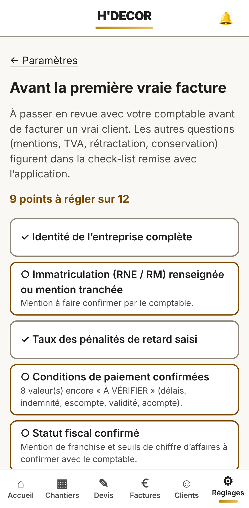

À faire, dans l'ordre :

1. **Entreprise** : SIRET, adresse, téléphone, email, IBAN et BIC, immatriculation.
2. **Statut fiscal** : franchise de TVA. Faites confirmer la mention et les seuils par votre comptable, puis cochez la confirmation.
3. **Assurances** : décennale et RC Pro (assureur, numéro de contrat, dates).
4. **Conditions et tarifs** : taux des pénalités de retard (obligatoire), délais, acompte, taux horaire. Confirmez chaque valeur après avis du comptable.
5. **Médiateur et mentions** : médiateur de la consommation, lien de demande d'avis Google.
6. **Textes des documents** : rétractation, médiateur, réception… Le texte proposé reste « À VÉRIFIER » tant que vous n'avez pas saisi la date de validation par le comptable.
7. **Logo** (en bas de Réglages) : PNG ou JPEG, 2 Mo au plus.
8. **Catalogue** : remplacez les produits d'exemple (marqués « fictif ») par vos vrais produits. Vérifiez rendement, couches et formats sur la fiche technique, puis marquez-les « vérifié ».
9. **Mon compte** : activez la **double authentification** (application d'authentification sur le téléphone).

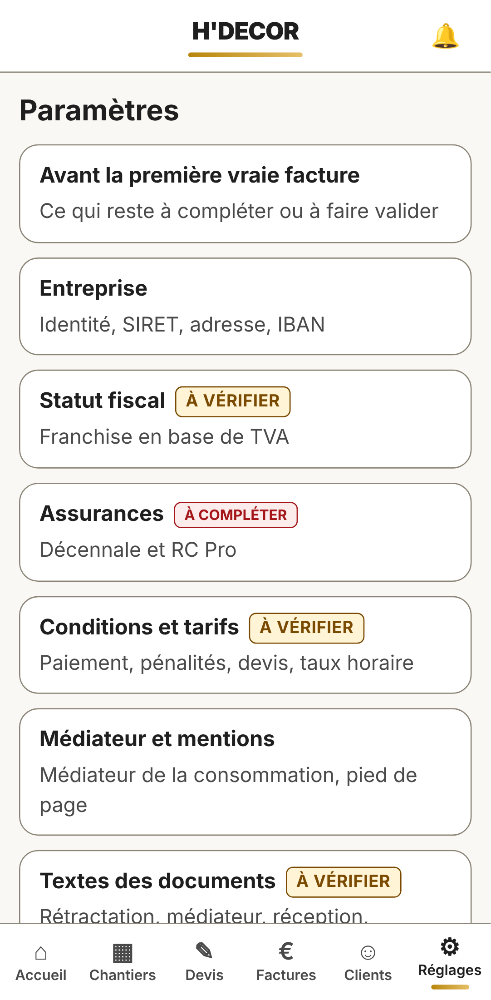

## 2. Un chantier et son métré

1. Onglet **Clients** > **+ Nouveau** : particulier ou professionnel, nom, téléphone, email, adresse. Enregistrer.
2. Sur la fiche du client : **+ Chantier**. Donnez un nom (« Appartement Martin »). Enregistrer.
3. Sur le chantier : **+ Pièce**. Longueur, largeur, hauteur sous plafond : les surfaces s'affichent tout de suite.
4. **+ Ajouter une ouverture** : porte (83 × 204 cm proposés) ou fenêtre. Elles sont déduites des murs.
5. Pièce identique : **Dupliquer la pièce…** et donnez-lui un nom.

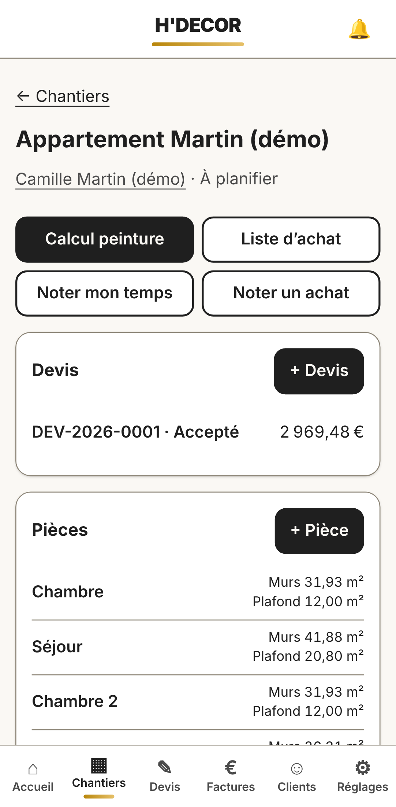

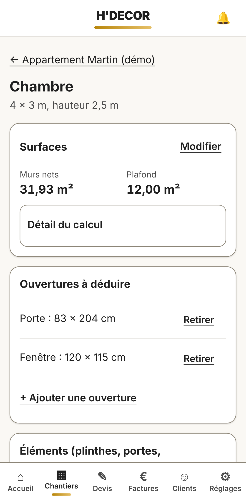

Pièce de référence : 4 × 3 m, hauteur 2,50 m, une porte et une fenêtre, soit **31,93 m²** de murs et **12,00 m²** de plafond. **Détail du calcul** montre chaque étape.

## 3. Peinture et liste d'achat

1. Sur la pièce : **Peinture de cette pièce**. Choisissez le support, le produit et le nombre de couches, puis **Enregistrer et calculer**.
2. L'application donne les litres, les pots (le moins de pots, ou le moins cher si les prix sont connus), les temps et le coût.
3. Sur le chantier : **Liste d'achat**, à partager au fournisseur ou en PDF.

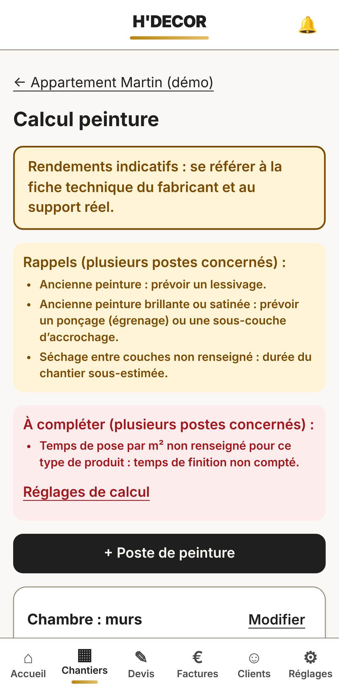

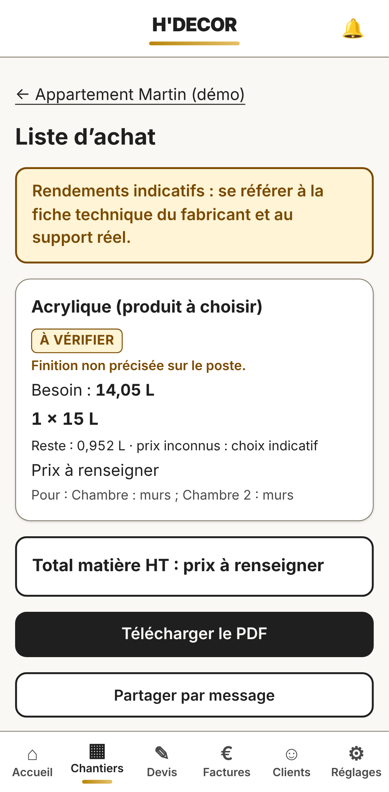

## 4. Le devis

1. Sur le chantier : **+ Devis**, puis **Créer le brouillon**. Les postes de peinture du chantier sont repris automatiquement.
2. Ligne marquée **PRIX À COMPLÉTER** : **Modifier**, saisissez le prix unitaire, **Enregistrer la ligne**.
3. **+ Ajouter une ligne** pour le reste (protection, forfait…). Cochez **Option** pour une ligne proposée hors total.
4. En-tête : durée, début des travaux, **Signé chez le client (hors établissement)** si vous signez chez lui (le formulaire de rétractation est alors joint).
5. **Émettre…** : l'application montre ce qui manque (bloquant) et ce qui est signalé. Relisez l'aperçu PDF, cochez la case, **Émettre le devis**. Le numéro DEV-AAAA-NNNN est attribué.

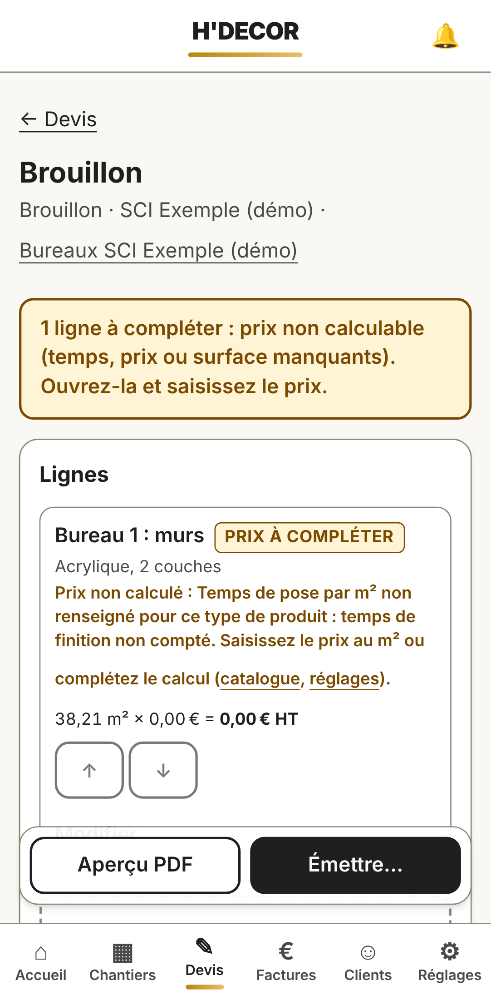

**Faire signer** :

- **Sur place** : **Faire signer sur place**. Le client écrit son nom et « Bon pour accord », signe au doigt dans le cadre et coche la case.
- **À distance** : **Créer un lien à partager** (SMS, WhatsApp) ou envoi par email si l'envoi est configuré.

Pour **changer un devis émis**, utilisez **Modifier : créer une nouvelle version**. L'ancienne version reste conservée.

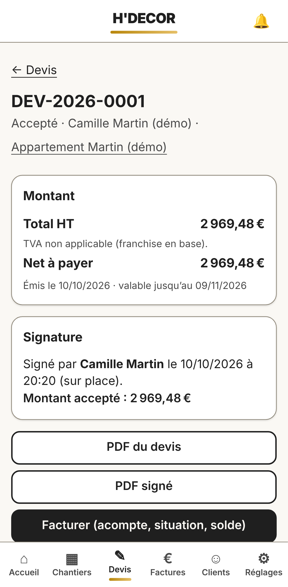

## 5. Les factures

Depuis le devis signé, **Facturer**, puis choisissez le type :

- **Acompte** : un pourcentage du devis (30 % par défaut).
- **Situation** : l'avancement des travaux en %, ajustable ligne par ligne.
- **Finale** : toutes les lignes, les acomptes et situations émis sont **déduits**.
- **Libre** (Factures > + Nouvelle) : travaux hors devis.

Ensuite : **Émettre…**, cochez, **Émettre la facture** (FAC-AAAA-NNNN). Pour **corriger ou annuler** : **Corriger ou annuler : établir un avoir** (AVO-AAAA-NNNN), sur tout le montant ou sur une partie.

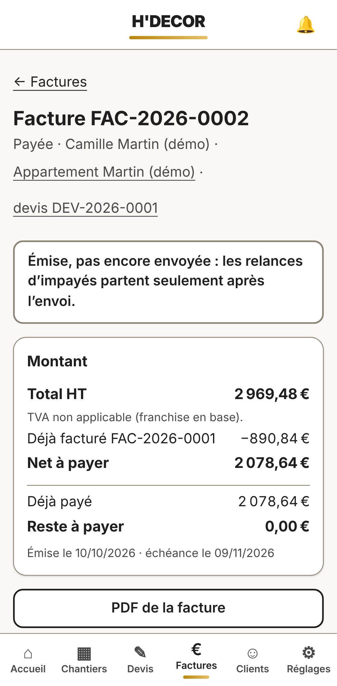

## 6. Paiements et relances

- Sur la facture : **Enregistrer un paiement**. Saisissez le montant et le mode (virement, espèces, chèque). Le reste à payer se met à jour.
- Paiement saisi par erreur : **Annuler ce paiement…**. Une écriture opposée est ajoutée, rien n'est effacé.
- Lien de la facture pour le client : reste à payer, QR code de virement, PDF.
- Relances : réglables dans **Réglages > Messages et relances**. Elles ne partent par email que si l'envoi est configuré.

## 7. Fin de chantier : PV, photos, avis

**Photos et documents** (sur le chantier) :

- photos avant, pendant et après, réduites et sans position GPS ;
- documents (fiches techniques, plans) ;
- la **galerie avant / après** n'est exportable qu'avec l'**accord du client** noté.

**Liste de fin** : touchez une ligne pour la cocher. La liste modèle se règle dans **Réglages > Fin de chantier**.

**PV de réception** :

1. Créez le PV : travaux, réserves (une par ligne), délai de levée.
2. **Présenter au client pour signature**.
3. **Étape 1** : le client remplit son nom et « Lu et approuvé », coche la case, signe, puis **Valider la signature du client**.
4. **Étape 2** : reprenez le téléphone, signez dans le cadre de l'entreprise, puis **Signer le procès-verbal**.
5. Plus tard, une réserve reprise se note avec **Noter la levée**.

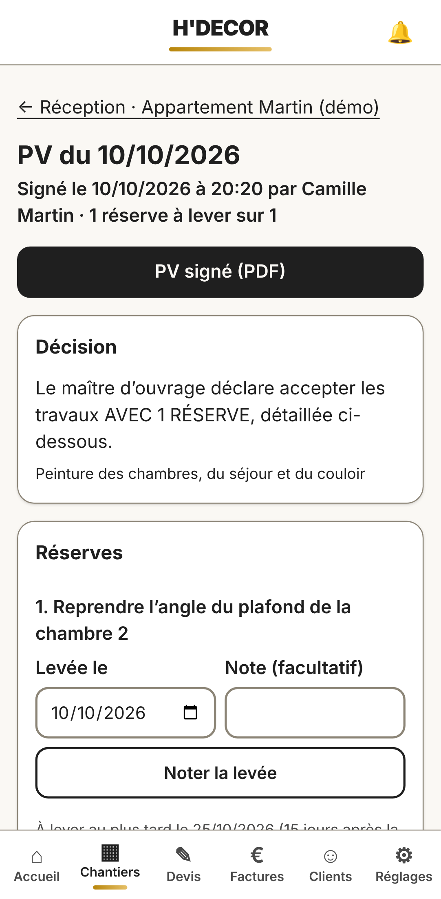

**Demande d'avis** : sur la facture finale **entièrement payée**, un seul avis par chantier. Le message neutre se copie ou se partage. Si le client refuse d'être sollicité, notez-le sur sa fiche.

## 8. Tableau de bord, planning, comptabilité

- **Accueil** :
  - chiffre d'affaires encaissé ;
  - jauges des seuils (visibles une fois les seuils saisis et confirmés) ;
  - tâches à faire et impayés.
- **Planning** :
  - un chantier se planifie en jours ouvrés depuis sa fiche (**Planifier**) ;
  - rendez-vous et rappels ;
  - export vers l'agenda du téléphone.
- **Sur le chantier** :
  - **Noter mon temps** (par exemple « 7h30 ») ;
  - **Noter un achat** (photo du ticket) ;
  - la rentabilité se calcule toute seule.
- **Comptabilité** :
  - livre des recettes, registre des achats, matériel ;
  - exports CSV, Excel et PDF par mois ou par année, à transmettre au comptable.

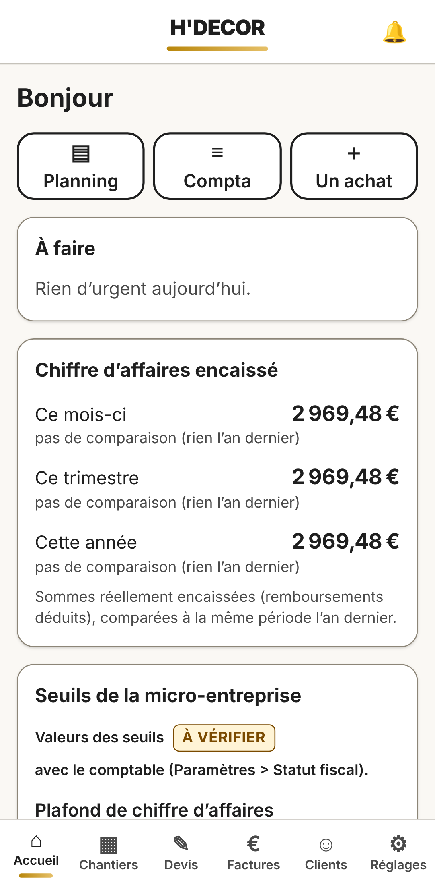

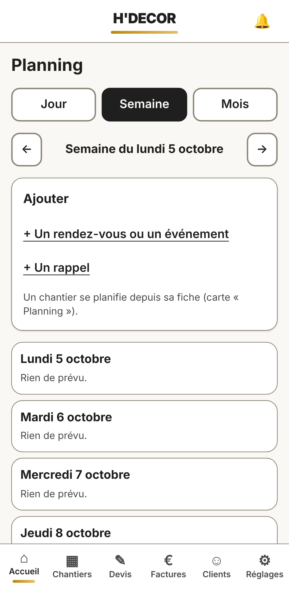

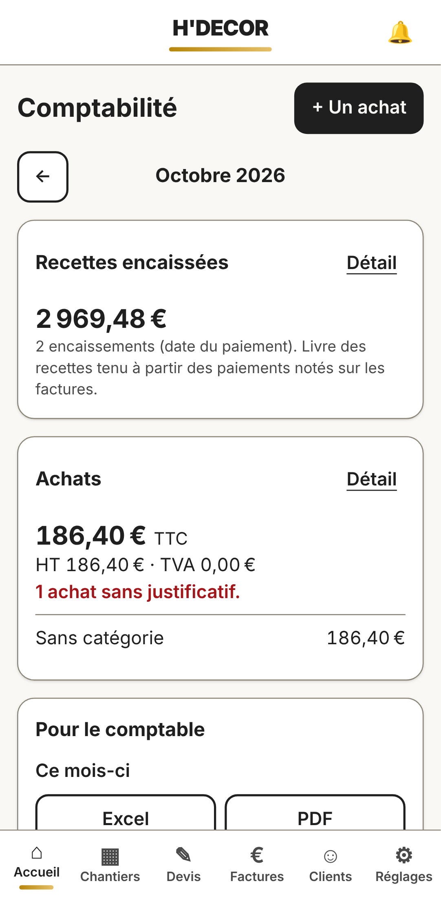

## 9. Sans réseau

- L'application **a besoin du réseau** pour enregistrer.
- Si le réseau coupe pendant une saisie, un bandeau prévient et **la saisie est gardée sur le téléphone**. Renvoyez-la quand le réseau revient.
- Sans réseau, une page qui n'a pas encore été ouverte ne s'affiche pas.

## 10. Ce que l'application ne fait pas

- Pas de travail **hors ligne** complet (voir § 9).
- **Factur-X** : les données sont préparées, mais rien n'est intégré au PDF ni transmis à une plateforme de facturation électronique.
- **Attestation de TVA à taux réduit** : pas produite. Les taux réduits sont donc bloqués (sans objet en franchise).
- Pas de **notification sur le téléphone** : la cloche est dans l'application, avec un email récapitulatif quotidien en option.
- **Jours fériés** non pris en compte dans le planning.
- **Annotation des photos** et **mode sombre** : reportés.
- **Levée des réserves** : déclarée par l'entreprise seule, sans document contresigné par le client.

## 11. En cas de problème

- **Message rouge** dans un formulaire : il dit quoi corriger, et le champ concerné est entouré.
- **Mot de passe oublié** : lien sur l'écran de connexion (email valable 15 minutes).
- **Erreur sur une facture émise** : un avoir, jamais une suppression.
- **Téléphone perdu** : changez le mot de passe depuis un autre appareil et réactivez la double authentification.
- **Autre problème** : notez l'heure, la page et le message, puis contactez la personne qui gère l'application.
